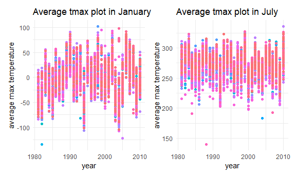
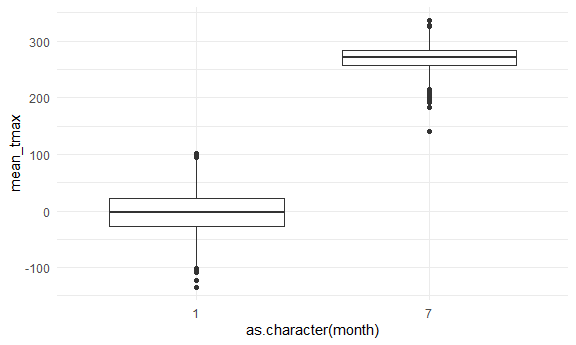
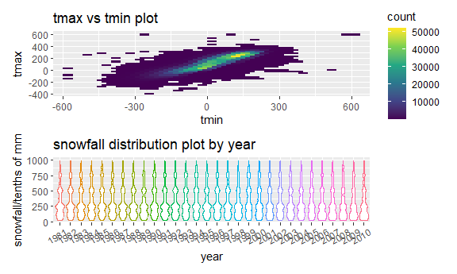

p8105 HW3
================
Jianming Wang
2024-10-8

# Problem 1

## Load the data

First, library the needed packages and set my plot settings.

``` r
library(tidyverse)
```

    ## ── Attaching core tidyverse packages ──────────────────────── tidyverse 2.0.0 ──
    ## ✔ dplyr     1.1.4     ✔ readr     2.1.5
    ## ✔ forcats   1.0.0     ✔ stringr   1.5.1
    ## ✔ ggplot2   3.5.1     ✔ tibble    3.2.1
    ## ✔ lubridate 1.9.3     ✔ tidyr     1.3.1
    ## ✔ purrr     1.0.2     
    ## ── Conflicts ────────────────────────────────────────── tidyverse_conflicts() ──
    ## ✖ dplyr::filter() masks stats::filter()
    ## ✖ dplyr::lag()    masks stats::lag()
    ## ℹ Use the conflicted package (<http://conflicted.r-lib.org/>) to force all conflicts to become errors

``` r
library(ggplot2)
library(patchwork)
```

``` r
knitr::opts_chunk$set(
  fig.width = 6,
  fig.asp = .6,
  out.width = '90%'
)

options(
  ggplot2.continuous.color = 'viridis',
  ggplot2.continuous.fill = 'viridis'
)

scale_color_discrete = scale_color_viridis_d
scale_fill_discrete = scale_fill_viridis_d
```

``` r
library(p8105.datasets)
data("ny_noaa")
```

## Clean the data

``` r
ny_noaa <- separate(ny_noaa,date, into= c("year","month","day"), sep = '-')
```

``` r
head(ny_noaa)
```

    ## # A tibble: 6 × 9
    ##   id          year  month day    prcp  snow  snwd tmax  tmin 
    ##   <chr>       <chr> <chr> <chr> <int> <int> <int> <chr> <chr>
    ## 1 US1NYAB0001 2007  11    01       NA    NA    NA <NA>  <NA> 
    ## 2 US1NYAB0001 2007  11    02       NA    NA    NA <NA>  <NA> 
    ## 3 US1NYAB0001 2007  11    03       NA    NA    NA <NA>  <NA> 
    ## 4 US1NYAB0001 2007  11    04       NA    NA    NA <NA>  <NA> 
    ## 5 US1NYAB0001 2007  11    05       NA    NA    NA <NA>  <NA> 
    ## 6 US1NYAB0001 2007  11    06       NA    NA    NA <NA>  <NA>

``` r
summary(ny_noaa)
```

    ##       id                year              month               day           
    ##  Length:2595176     Length:2595176     Length:2595176     Length:2595176    
    ##  Class :character   Class :character   Class :character   Class :character  
    ##  Mode  :character   Mode  :character   Mode  :character   Mode  :character  
    ##                                                                             
    ##                                                                             
    ##                                                                             
    ##                                                                             
    ##       prcp               snow             snwd            tmax          
    ##  Min.   :    0.00   Min.   :  -13    Min.   :   0.0   Length:2595176    
    ##  1st Qu.:    0.00   1st Qu.:    0    1st Qu.:   0.0   Class :character  
    ##  Median :    0.00   Median :    0    Median :   0.0   Mode  :character  
    ##  Mean   :   29.82   Mean   :    5    Mean   :  37.3                     
    ##  3rd Qu.:   23.00   3rd Qu.:    0    3rd Qu.:   0.0                     
    ##  Max.   :22860.00   Max.   :10160    Max.   :9195.0                     
    ##  NA's   :145838     NA's   :381221   NA's   :591786                     
    ##      tmin          
    ##  Length:2595176    
    ##  Class :character  
    ##  Mode  :character  
    ##                    
    ##                    
    ##                    
    ## 

The data has 9 variables after seperating year, month and day, and has
2595176 observations. Variables id, year, month, day, tmax(Maximum
temperature with unit tenths of degrees C) and tmin(Minimum temperature
with unit tenths of degrees C) are characters, while variables
prcp(Precipitation with unit tenths of mm), snow(Snowfall with unit mm),
snwd(Snow depth with unit mm) are numeric. For convenience in analyzing,
I convert year, mont, day, tmin and tmax to numeric variables. For the
consistency of units, I change the unit of variables snow and snwd into
tenths of mm.

``` r
ny_noaa <- mutate(year = as.numeric(year), month = as.numeric(month), 
                  day = as.numeric(day),
                  ny_noaa,tmax = as.numeric(tmax),tmin = as.numeric(tmin),
                  snow = 10*snow, snwd = 10*snwd)
summary(ny_noaa)
```

    ##       id                 year          month             day       
    ##  Length:2595176     Min.   :1981   Min.   : 1.000   Min.   : 1.00  
    ##  Class :character   1st Qu.:1988   1st Qu.: 4.000   1st Qu.: 8.00  
    ##  Mode  :character   Median :1997   Median : 7.000   Median :16.00  
    ##                     Mean   :1996   Mean   : 6.565   Mean   :15.73  
    ##                     3rd Qu.:2005   3rd Qu.:10.000   3rd Qu.:23.00  
    ##                     Max.   :2010   Max.   :12.000   Max.   :31.00  
    ##                                                                    
    ##       prcp               snow               snwd              tmax        
    ##  Min.   :    0.00   Min.   :  -130.0   Min.   :    0.0   Min.   :-389.0   
    ##  1st Qu.:    0.00   1st Qu.:     0.0   1st Qu.:    0.0   1st Qu.:  50.0   
    ##  Median :    0.00   Median :     0.0   Median :    0.0   Median : 150.0   
    ##  Mean   :   29.82   Mean   :    49.9   Mean   :  373.1   Mean   : 139.8   
    ##  3rd Qu.:   23.00   3rd Qu.:     0.0   3rd Qu.:    0.0   3rd Qu.: 233.0   
    ##  Max.   :22860.00   Max.   :101600.0   Max.   :91950.0   Max.   : 600.0   
    ##  NA's   :145838     NA's   :381221     NA's   :591786    NA's   :1134358  
    ##       tmin        
    ##  Min.   :-594.0   
    ##  1st Qu.: -39.0   
    ##  Median :  33.0   
    ##  Mean   :  30.3   
    ##  3rd Qu.: 111.0   
    ##  Max.   : 600.0   
    ##  NA's   :1134420

``` r
ny_noaa|>
  count(snow,sort = T)
```

    ## # A tibble: 282 × 2
    ##     snow       n
    ##    <dbl>   <int>
    ##  1     0 2008508
    ##  2    NA  381221
    ##  3   250   31022
    ##  4   130   23095
    ##  5   510   18274
    ##  6   760   10173
    ##  7    80    9962
    ##  8    50    9748
    ##  9   380    9197
    ## 10    30    8790
    ## # ℹ 272 more rows

For snowfall, the most commonly observed values are 0, with the number
2008508. That is beacause in most of time in each year, it doesn’t snow.

``` r
ny_noaa|>filter(snow<0)|>nrow()
```

    ## [1] 1

What’s more, there is an error in snowfall because snowfall is
impossible to be negative. Considering the overall data of snowfall, I
strongly believe a minus sign was added incorrectly, So I remove the
minus sign.

``` r
ny_noaa <- mutate(ny_noaa,snow = if_else(snow>0, snow, -snow))
```

## Drawing plot I

``` r
ny_subset1 <- ny_noaa|>
  filter(month %in% c(1,7))|>
  group_by(id,year,month)|>
  summarise(mean_tmax = mean(tmax,na.rm = T),.groups = 'keep')
```

``` r
p1 <- ny_subset1|>
  filter(month == 1)|>
  ggplot(aes(x = year, y = mean_tmax,color = id))+
  geom_point()+
  theme(legend.position='none')+
  labs(
    title = "Average tmax plot in January",
    x = "year",
    y = "average max temperature")
p2 <- ny_subset1|>
  filter(month == 7)|>
  ggplot(aes(x = year, y = mean_tmax,color = id))+
  geom_point()+
  theme(legend.position='none')+
  labs(
    title = "Average tmax plot in July",
    x = "year",
    y = "average max temperature")
p1+p2 #colors represent different stations
```

    ## Warning: Removed 2923 rows containing missing values or values outside the scale range
    ## (`geom_point()`).

    ## Warning: Removed 3047 rows containing missing values or values outside the scale range
    ## (`geom_point()`).


Through the 2 panel plot we can find that the average max temperatures
in january are generally higher than in July, which means it is hotter
in January than in July. There exist some outliers in both January and
July, for example as shown in the plot, the blue bottom point in 1980s
in January and the pink bottom point in 1980s in July.

``` r
ny_subset1|>
  ggplot(aes(x = as.character(month), y = mean_tmax))+
  geom_boxplot()
```

    ## Warning: Removed 5970 rows containing non-finite outside the scale range
    ## (`stat_boxplot()`).


Through the boxplot we can also find outliers, which are represented as
black points.

## Drawing plot II

Because I changed the unit for snowfall from mm to tenths of mm, the
range changes from 0~100 to 0~1000.

``` r
p1 <- ny_noaa|>
  ggplot(aes(x = tmin, y = tmax))+
  geom_hex()+
  theme(legend.position='right')+
  labs(
    title = "tmax vs tmin plot")
p2 <- ny_noaa|>
  filter(snow>0 & snow<1000)|>
  ggplot(aes(x = as.character(year), y = snow,color = as.character(year)))+
  geom_violin()+
  theme(legend.position='none',
        axis.text.x = element_text(angle = 30,vjust = 0.85,hjust = 0.75))+
  labs(x = 'year',
       y = 'snowfall/tenths of mm',
    title = "snowfall distribution plot by year")
p1/p2 
```

    ## Warning: Removed 1136276 rows containing non-finite outside the scale range
    ## (`stat_binhex()`).


