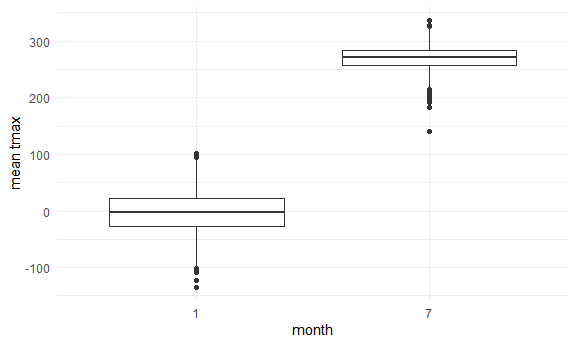
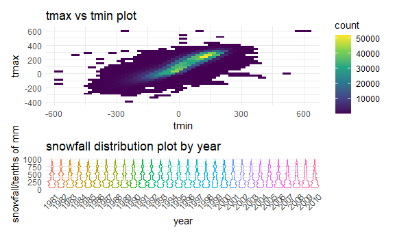
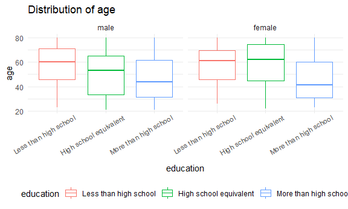
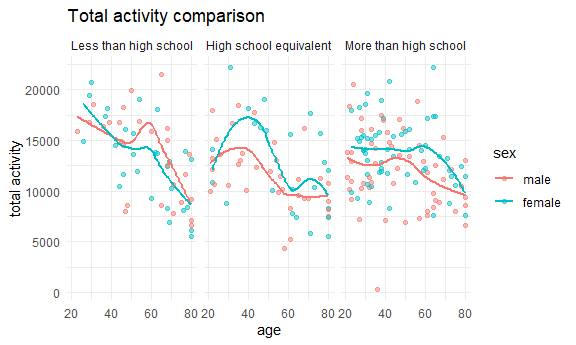
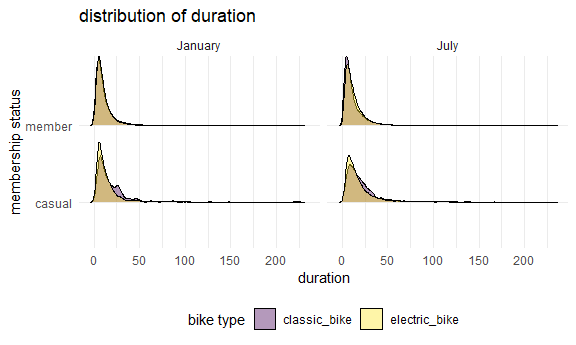

p8105 HW3 jw4693
================
Jianming Wang
2024-10-8

# Problem 1

## Load the data

First, library the needed packages and set my plot settings.

``` r
library(tidyverse)
```

    ## ── Attaching core tidyverse packages ──────────────────────── tidyverse 2.0.0 ──
    ## ✔ dplyr     1.1.4     ✔ readr     2.1.5
    ## ✔ forcats   1.0.0     ✔ stringr   1.5.1
    ## ✔ ggplot2   3.5.1     ✔ tibble    3.2.1
    ## ✔ lubridate 1.9.3     ✔ tidyr     1.3.1
    ## ✔ purrr     1.0.2     
    ## ── Conflicts ────────────────────────────────────────── tidyverse_conflicts() ──
    ## ✖ dplyr::filter() masks stats::filter()
    ## ✖ dplyr::lag()    masks stats::lag()
    ## ℹ Use the conflicted package (<http://conflicted.r-lib.org/>) to force all conflicts to become errors

``` r
library(ggplot2)
library(patchwork)
library(ggridges)
```

``` r
knitr::opts_chunk$set(
  fig.width = 6,
  fig.asp = .6,
  out.width = '90%'
)

options(
  ggplot2.continuous.color = 'viridis',
  ggplot2.continuous.fill = 'viridis'
)

scale_color_discrete = scale_color_viridis_d
scale_fill_discrete = scale_fill_viridis_d
```

``` r
library(p8105.datasets)
data("ny_noaa")
```

## Clean the data

``` r
ny_noaa <- separate(ny_noaa,date, into= c("year","month","day"), sep = '-')
```

``` r
head(ny_noaa)
```

    ## # A tibble: 6 × 9
    ##   id          year  month day    prcp  snow  snwd tmax  tmin 
    ##   <chr>       <chr> <chr> <chr> <int> <int> <int> <chr> <chr>
    ## 1 US1NYAB0001 2007  11    01       NA    NA    NA <NA>  <NA> 
    ## 2 US1NYAB0001 2007  11    02       NA    NA    NA <NA>  <NA> 
    ## 3 US1NYAB0001 2007  11    03       NA    NA    NA <NA>  <NA> 
    ## 4 US1NYAB0001 2007  11    04       NA    NA    NA <NA>  <NA> 
    ## 5 US1NYAB0001 2007  11    05       NA    NA    NA <NA>  <NA> 
    ## 6 US1NYAB0001 2007  11    06       NA    NA    NA <NA>  <NA>

``` r
summary(ny_noaa)
```

    ##       id                year              month               day           
    ##  Length:2595176     Length:2595176     Length:2595176     Length:2595176    
    ##  Class :character   Class :character   Class :character   Class :character  
    ##  Mode  :character   Mode  :character   Mode  :character   Mode  :character  
    ##                                                                             
    ##                                                                             
    ##                                                                             
    ##                                                                             
    ##       prcp               snow             snwd            tmax          
    ##  Min.   :    0.00   Min.   :  -13    Min.   :   0.0   Length:2595176    
    ##  1st Qu.:    0.00   1st Qu.:    0    1st Qu.:   0.0   Class :character  
    ##  Median :    0.00   Median :    0    Median :   0.0   Mode  :character  
    ##  Mean   :   29.82   Mean   :    5    Mean   :  37.3                     
    ##  3rd Qu.:   23.00   3rd Qu.:    0    3rd Qu.:   0.0                     
    ##  Max.   :22860.00   Max.   :10160    Max.   :9195.0                     
    ##  NA's   :145838     NA's   :381221   NA's   :591786                     
    ##      tmin          
    ##  Length:2595176    
    ##  Class :character  
    ##  Mode  :character  
    ##                    
    ##                    
    ##                    
    ## 

The data has 9 variables after seperating year, month and day, and has
2595176 observations. Variables id, year, month, day, tmax(Maximum
temperature with unit tenths of degrees C) and tmin(Minimum temperature
with unit tenths of degrees C) are characters, while variables
prcp(Precipitation with unit tenths of mm), snow(Snowfall with unit mm),
snwd(Snow depth with unit mm) are numeric. For convenience in analyzing,
I convert year, mont, day, tmin and tmax to numeric variables. For the
consistency of units, I change the unit of variables snow and snwd into
tenths of mm.

``` r
ny_noaa <- mutate(year = as.numeric(year), month = as.numeric(month), 
                  day = as.numeric(day),
                  ny_noaa,tmax = as.numeric(tmax),tmin = as.numeric(tmin),
                  snow = 10*snow, snwd = 10*snwd)
summary(ny_noaa)
```

    ##       id                 year          month             day       
    ##  Length:2595176     Min.   :1981   Min.   : 1.000   Min.   : 1.00  
    ##  Class :character   1st Qu.:1988   1st Qu.: 4.000   1st Qu.: 8.00  
    ##  Mode  :character   Median :1997   Median : 7.000   Median :16.00  
    ##                     Mean   :1996   Mean   : 6.565   Mean   :15.73  
    ##                     3rd Qu.:2005   3rd Qu.:10.000   3rd Qu.:23.00  
    ##                     Max.   :2010   Max.   :12.000   Max.   :31.00  
    ##                                                                    
    ##       prcp               snow               snwd              tmax        
    ##  Min.   :    0.00   Min.   :  -130.0   Min.   :    0.0   Min.   :-389.0   
    ##  1st Qu.:    0.00   1st Qu.:     0.0   1st Qu.:    0.0   1st Qu.:  50.0   
    ##  Median :    0.00   Median :     0.0   Median :    0.0   Median : 150.0   
    ##  Mean   :   29.82   Mean   :    49.9   Mean   :  373.1   Mean   : 139.8   
    ##  3rd Qu.:   23.00   3rd Qu.:     0.0   3rd Qu.:    0.0   3rd Qu.: 233.0   
    ##  Max.   :22860.00   Max.   :101600.0   Max.   :91950.0   Max.   : 600.0   
    ##  NA's   :145838     NA's   :381221     NA's   :591786    NA's   :1134358  
    ##       tmin        
    ##  Min.   :-594.0   
    ##  1st Qu.: -39.0   
    ##  Median :  33.0   
    ##  Mean   :  30.3   
    ##  3rd Qu.: 111.0   
    ##  Max.   : 600.0   
    ##  NA's   :1134420

``` r
ny_noaa|>
  count(snow,sort = T)
```

    ## # A tibble: 282 × 2
    ##     snow       n
    ##    <dbl>   <int>
    ##  1     0 2008508
    ##  2    NA  381221
    ##  3   250   31022
    ##  4   130   23095
    ##  5   510   18274
    ##  6   760   10173
    ##  7    80    9962
    ##  8    50    9748
    ##  9   380    9197
    ## 10    30    8790
    ## # ℹ 272 more rows

For snowfall, the most commonly observed values are 0, with the number
2008508. That is beacause in most of time in each year, it doesn’t snow.

``` r
ny_noaa|>filter(snow<0)|>nrow()
```

    ## [1] 1

What’s more, there is an error in snowfall because snowfall is
impossible to be negative. Considering the overall data of snowfall, I
strongly believe a minus sign was added incorrectly, So I remove the
minus sign.

``` r
ny_noaa <- mutate(ny_noaa,snow = if_else(snow>0, snow, -snow))
```

## Drawing plot I

``` r
ny_subset1 <- ny_noaa|>
  filter(month %in% c(1,7))|>
  group_by(id,year,month)|>
  summarise(mean_tmax = mean(tmax,na.rm = T),.groups = 'keep')
```

``` r
p1 <- ny_subset1|>
  filter(month == 1)|>
  ggplot(aes(x = year, y = mean_tmax,color = id))+
  geom_point()+
  theme_minimal()+
  theme(legend.position='none')+
  labs(
    title = "Average tmax plot in January",
    x = "year",
    y = "average max temperature")
p2 <- ny_subset1|>
  filter(month == 7)|>
  ggplot(aes(x = year, y = mean_tmax,color = id))+
  geom_point()+
  theme_minimal()+
  theme(legend.position='none')+
  labs(
    title = "Average tmax plot in July",
    x = "year",
    y = "average max temperature")
p1+p2 #colors represent different stations
```

    ## Warning: Removed 2923 rows containing missing values or values outside the scale range
    ## (`geom_point()`).

    ## Warning: Removed 3047 rows containing missing values or values outside the scale range
    ## (`geom_point()`).


Through the 2 panel plot we can find that the average max temperatures
in january are generally higher than in July, which means it is hotter
in January than in July. There exist some outliers in both January and
July, for example as shown in the plot, the blue bottom point in 1980s
in January and the pink bottom point in 1980s in July.

``` r
ny_subset1|>
  ggplot(aes(x = as.character(month), y = mean_tmax))+
  geom_boxplot()+
  theme_minimal()+
  labs(
    x = "month",
    y = "mean tmax")
```

    ## Warning: Removed 5970 rows containing non-finite outside the scale range
    ## (`stat_boxplot()`).


Through the boxplot we can also find outliers, which are represented as
black points.

## Drawing plot II

Because I changed the unit for snowfall from mm to tenths of mm, the
range changes from 0~100 to 0~1000.

``` r
p1 <- ny_noaa|>
  ggplot(aes(x = tmin, y = tmax))+
  geom_hex()+
  theme_minimal()+
  theme(legend.position='right')+
  labs(
    title = "tmax vs tmin plot")
p2 <- ny_noaa|>
  filter(snow>0 & snow<1000)|>
  ggplot(aes(x = as.character(year), y = snow,color = as.character(year)))+
  geom_violin()+
  theme_minimal()+
  theme(legend.position='none',
        axis.text.x = element_text(angle = 45,vjust = 0.85,hjust = 0.75))+
  labs(x = 'year',
       y = 'snowfall/tenths of mm',
    title = "snowfall distribution plot by year")
p1+p2+
  plot_layout(heights = c(2.5,1))
```

    ## Warning: Removed 1136276 rows containing non-finite outside the scale range
    ## (`stat_binhex()`).



# Problem 2

## Load, tidy, merge and organize

## Produce table and visualization

``` r
demographic <- read_csv('./nhanes_covar.csv', skip = 4)
```

    ## Rows: 250 Columns: 5
    ## ── Column specification ────────────────────────────────────────────────────────
    ## Delimiter: ","
    ## dbl (5): SEQN, sex, age, BMI, education
    ## 
    ## ℹ Use `spec()` to retrieve the full column specification for this data.
    ## ℹ Specify the column types or set `show_col_types = FALSE` to quiet this message.

``` r
accelerometer <- read_csv('./nhanes_accel.csv')
```

    ## Rows: 250 Columns: 1441
    ## ── Column specification ────────────────────────────────────────────────────────
    ## Delimiter: ","
    ## dbl (1441): SEQN, min1, min2, min3, min4, min5, min6, min7, min8, min9, min1...
    ## 
    ## ℹ Use `spec()` to retrieve the full column specification for this data.
    ## ℹ Specify the column types or set `show_col_types = FALSE` to quiet this message.

``` r
demographic <- demographic|>na.omit()
acc_data <- left_join(demographic,accelerometer, by = 'SEQN')|>
  pivot_longer(
    min1:min1440,
    names_to = "minute_interval",
    values_to = "MIMS"
  )|>
  filter(age >= 21)|>
  mutate(sex = factor(sex,labels = c('male','female')),
         education = factor(education, labels = c('Less than high school','High school equivalent','More than high school')),
         minute_interval = str_remove(minute_interval,'min'))
```

I merge the data and remove observations with age less than 21 or
missing data in demographic data. Variable sex and education are set to
be factors, repectively with levels “male, female” and “Less than high
school, High school equivalent, More than high school”. Also, I remove
strings “min” from variable “minute_interval”.

``` r
num_data <- acc_data|>
  select(SEQN,sex,education)|>
  unique()|>
  mutate(num = 1)|>
  group_by(sex, education)|>
  summarise(number = sum(num), .groups = 'keep')
readable_data <- num_data|>
  pivot_wider(
    names_from = 'education',
    values_from = 'number'
  )
readable_data
```

    ## # A tibble: 2 × 4
    ## # Groups:   sex [2]
    ##   sex    `Less than high school` `High school equivalent` More than high schoo…¹
    ##   <fct>                    <dbl>                    <dbl>                  <dbl>
    ## 1 male                        27                       35                     56
    ## 2 female                      28                       23                     59
    ## # ℹ abbreviated name: ¹​`More than high school`

I first produce a table for numbers of men and women in different
educational categories, and then use “pivot_wider” to produce a
reader-friendly table.

``` r
p1 <- acc_data|>
  select(SEQN,sex,education)|>
  unique()|>
  mutate(num = 1)|>
  group_by(sex, education)|>
  summarise(number = sum(num), .groups = 'keep')|>
  ggplot(aes(x = education, y = number)) + 
  theme_minimal()+
  theme(axis.text.x = element_text(angle = 30,vjust = 0.85,hjust = 0.75))+
  geom_col(aes(fill=sex), position = position_dodge2(preserve = 'single')) +
  geom_text(aes(label=number), 
            position = position_dodge2(width = 0.9, preserve = 'single'), 
            vjust = -0.2, hjust = 0.5)
p2 <- acc_data|>
  select(SEQN,sex,education)|>
  unique()|>
  ggplot(aes(x = education)) +
  geom_bar(aes(fill = sex), 
                   position = 'fill')+
  theme_minimal()+
  theme(axis.text.x = element_text(angle = 30,vjust = 0.85,hjust = 0.75))
p1+p2
```


Through the plot wecan find that people with more than high school
education have the highest percentage in both men and women. The number
of men with less than high school education is less than women, and the
number of men with high school equivalent education is more than women.

``` r
acc_data|>
  select(SEQN,sex,education,age)|>
  unique()|>
  ggplot(aes(y = age, x = education, color = education)) +
  geom_boxplot()+
  theme_minimal()+
  theme(legend.position='bottom')+
  facet_grid(. ~ sex)+
  labs(
    title = "Distribution of age",
    x = "education",
    y = "age")+
   theme(axis.text.x = element_text(angle = 30,vjust = 0.85,hjust = 0.75))
```


The median age increases with higher education levels for both males and
females. Males generally have a wider distribution of ages compared to
females in each education category. This plot suggests that individuals
with lower education levels tend to be older. This might reflect
patterns related to generational differences, where older individuals
might have had less access to higher education. Additionally, the
greater age variability in males might indicate a broader range of
educational attainment across different ages in the male population
compared to females.

## Total activities

``` r
total_act <- acc_data|>
  group_by(SEQN, age, sex, education)|>
  summarise(total_activity = sum(MIMS), .groups = "keep")
ggplot(total_act, aes(x = age, y = total_activity, color = sex))+
  geom_point(alpha = .5) +
  geom_smooth(se = FALSE) + 
  theme_minimal()+
  facet_grid(. ~ education)+
  labs(
    title = "Total activity comparison",
    x = "age",
    y = "total activity")
```

    ## `geom_smooth()` using method = 'loess' and formula = 'y ~ x'


In the graph, male data are shown in red and female data in blue.
Overall, women’s total activity is higher than men’s across all ages in
the right two graphs, with women’s total activity being higher than
men’s up to about age 40 and lower than men’s after age 40 in the left
first graph. In terms of overall trends, people at all levels of
education experience a decrease in total activity after about age of 60,
and those with less than high school education have the highest total
activity at around age of 20 and those with a high school equivalent
education have the highest total activity at around age 40. People with
more than high school education will remain at a relatively high level
of total activity before the age of 60.

## 3 panel plot

``` r
p1 <- acc_data|>
  filter(education == 'Less than high school')|>
  mutate(hourtime = ceiling(as.numeric(minute_interval)/60))|>
  group_by(SEQN, sex, hourtime)|>
  summarise(mean_MIMS_per_hour = mean(MIMS), .groups = 'keep')|>
  ggplot(aes(x = hourtime, y = mean_MIMS_per_hour, color = sex))+
  geom_point(alpha = .5) +
  geom_smooth(se = FALSE) + 
  theme_minimal()+
  theme(legend.position='bottom')+
  labs(
    title = "less than high school",
    x = "hour interval",
    y = "mean MIMS per hour")

p2 <- acc_data|>
  filter(education == 'High school equivalent')|>
  mutate(hourtime = ceiling(as.numeric(minute_interval)/60))|>
  group_by(SEQN, sex, hourtime)|>
  summarise(mean_MIMS_per_hour = mean(MIMS),.groups = 'keep')|>
  ggplot(aes(x = hourtime, y = mean_MIMS_per_hour, color = sex))+
  geom_point(alpha = .5) +
  geom_smooth(se = FALSE) +
  theme_minimal()+
  theme(legend.position='bottom')+
  labs(
    title = "high school equivalent",
    x = "hour interval",
    y = "mean MIMS per hour")

p3 <- acc_data|>
  filter(education == 'More than high school')|>
  mutate(hourtime = ceiling(as.numeric(minute_interval)/60))|>
  group_by(SEQN, sex, hourtime)|>
  summarise(mean_MIMS_per_hour = mean(MIMS),.groups = 'keep')|>
  ggplot(aes(x = hourtime, y = mean_MIMS_per_hour, color = sex))+
  geom_point(alpha = .5) +
  geom_smooth(se = FALSE) + 
  theme_minimal()+
  theme(legend.position='bottom')+
  labs(
    title = "more than high school",
    x = "hour interval",
    y = "mean MIMS per hour")
p1+p2+p3
```

    ## `geom_smooth()` using method = 'loess' and formula = 'y ~ x'
    ## `geom_smooth()` using method = 'loess' and formula = 'y ~ x'
    ## `geom_smooth()` using method = 'gam' and formula = 'y ~ s(x, bs = "cs")'


Each observation has 1440 data points, which would result in too much
data, a complicated picture, and the inability to fit a curve if plotted
and fitted directly to the curve. Therefore, I averaged the MIMS for
each hour to reduce the number of data points while retaining the trend
information. There appears to be a clear upward shift in MIMS activity
as education level increases. Those with higher education engage in more
activity or have higher MMNS rates, especially noticeable among females
in the “More than High School” group. Across all education levels,
females generally exhibit higher MMNS rates, particularly after the peak
hours, showing more consistent and sustained activity compared to males.
All groups show increased activity from the early morning hours, with
peaks typically occurring between hours 10-15. However, more educated
individuals, particularly females, tend to maintain higher activity
levels throughout the later hours of the day.

# Problem 3

## Import, clean, and tidy data

``` r
jan2020 <- read_csv('./Jan 2020 Citi.csv')
```

    ## Rows: 12420 Columns: 7
    ## ── Column specification ────────────────────────────────────────────────────────
    ## Delimiter: ","
    ## chr (6): ride_id, rideable_type, weekdays, start_station_name, end_station_n...
    ## dbl (1): duration
    ## 
    ## ℹ Use `spec()` to retrieve the full column specification for this data.
    ## ℹ Specify the column types or set `show_col_types = FALSE` to quiet this message.

``` r
july2020 <- read_csv('./July 2020 Citi.csv')
```

    ## Rows: 21048 Columns: 7
    ## ── Column specification ────────────────────────────────────────────────────────
    ## Delimiter: ","
    ## chr (6): ride_id, rideable_type, weekdays, start_station_name, end_station_n...
    ## dbl (1): duration
    ## 
    ## ℹ Use `spec()` to retrieve the full column specification for this data.
    ## ℹ Specify the column types or set `show_col_types = FALSE` to quiet this message.

``` r
jan2024 <-read_csv('./Jan 2024 Citi.csv')
```

    ## Rows: 18861 Columns: 7
    ## ── Column specification ────────────────────────────────────────────────────────
    ## Delimiter: ","
    ## chr (6): ride_id, rideable_type, weekdays, start_station_name, end_station_n...
    ## dbl (1): duration
    ## 
    ## ℹ Use `spec()` to retrieve the full column specification for this data.
    ## ℹ Specify the column types or set `show_col_types = FALSE` to quiet this message.

``` r
july2024 <- read_csv('./July 2024 Citi.csv')
```

    ## Rows: 47156 Columns: 7
    ## ── Column specification ────────────────────────────────────────────────────────
    ## Delimiter: ","
    ## chr (6): ride_id, rideable_type, weekdays, start_station_name, end_station_n...
    ## dbl (1): duration
    ## 
    ## ℹ Use `spec()` to retrieve the full column specification for this data.
    ## ℹ Specify the column types or set `show_col_types = FALSE` to quiet this message.

``` r
jan2020 <- jan2020|>
  mutate(month = "January", year = "2020")
jan2024 <- jan2024|>
  mutate(month = "January", year = "2024")
july2020 <- july2020|>
  mutate(month = "July", year = "2020")
july2024 <- july2024|>
  mutate(month = "July", year = "2024")
citibike <- bind_rows(jan2020, july2020, jan2024, july2024)
```

For data of each month, I add month and year as new columns and the
merge them. The combined dataset has 99485 observations and 9 variables,
including information about id of rides, rideable type, weekdays, total
duration, start stations, destinations, member or casual, months and
years.

## Reader-friendly table

``` r
read_table <- citibike|>
  mutate(num = 1)|>
  group_by(member_casual, year, month)|>
  summarise(number_of_rides = sum(num), .groups = 'keep')
read_table
```

    ## # A tibble: 8 × 4
    ## # Groups:   member_casual, year, month [8]
    ##   member_casual year  month   number_of_rides
    ##   <chr>         <chr> <chr>             <dbl>
    ## 1 casual        2020  January             984
    ## 2 casual        2020  July               5637
    ## 3 casual        2024  January            2108
    ## 4 casual        2024  July              10894
    ## 5 member        2020  January           11436
    ## 6 member        2020  July              15411
    ## 7 member        2024  January           16753
    ## 8 member        2024  July              36262

As shown in the reader-friendly table, it has 8 rows and 4 variables,
including member or casual, year, month and number of rides. The total
numbers of casual riders riding in Jan. 2020, July 2020, Jan. 2024, July
2024 are respectively 984, 5637, 2108, 10894. The total numbers of Citi
Bike members riding in Jan. 2020, July 2020, Jan. 2024, July 2024 are
respectively 11436, 15411, 16753, 36262. In general, the number of
casual riders is less than Citi Bike members.

## Most popular starting stations in July 2024

``` r
popular <- citibike|>
  mutate(num = 1)|>
  filter(year == 2024, month == 'July')|>
  group_by(start_station_name)|>
  summarise(number_of_rides = sum(num), .groups = 'keep')|>
  arrange(desc(number_of_rides))|>
  head(5)
popular
```

    ## # A tibble: 5 × 2
    ## # Groups:   start_station_name [5]
    ##   start_station_name       number_of_rides
    ##   <chr>                              <dbl>
    ## 1 Pier 61 at Chelsea Piers             163
    ## 2 University Pl & E 14 St              155
    ## 3 W 21 St & 6 Ave                      152
    ## 4 West St & Chambers St                150
    ## 5 W 31 St & 7 Ave                      146

The 5 most popular starting stations are Pier 61 at Chelsea Piers with
163 rides, University Pl & E 14 St with 155 rides, W 21 St & 6 Ave with
152 rides, West St & Chambers St with 150 rides and W 31 St & 7 Ave with
146 rides.

## Investigate the effects of days of thr week, month and year

``` r
Investigate <- citibike|>
  group_by(weekdays, month, year)|>
  summarise(median_of_duration = median(duration), .groups = 'keep')|>
  mutate(weekdays = factor(weekdays, levels = c('Monday','Tuesday','Wednesday','Thursday','Friday','Saturday','Sunday')))
```

First, I produced a table of median duration in terms of weekdays, month
and year. Then I drew a plot for comparison.

``` r
Investigate|>
  ggplot(aes(x = weekdays, y = median_of_duration, colour = month, group = month)) + geom_line()+
  theme_minimal()+
theme(legend.position='bottom',
      axis.text.x = element_text(angle = 30,vjust = 0.85,hjust = 0.75))+
  facet_grid(. ~ year)+
  labs(
    title = "median duration comparison",
    x = "weekday",
    y = "median of duration")
```


As shown in the plot, July tends to have longer median duration compared
to January in both years, suggesting a seasonal pattern. The day of the
week with the highest median duration varies between Saturday and Sunday
in July. January remains more consistent, with moderate increases in
duration on the weekends but generally lower than July across all
weekdays. Across years, the overall duration has a reduction from 2020
to 2024.

## Distribution of duration in 2024

``` r
p1 <- citibike|>
  filter(year == '2024')|>
  ggplot(aes(x = duration, y = member_casual, fill = rideable_type)) + 
  geom_density_ridges(scale = .9, alpha = .4)+
  theme_minimal()+
  theme(legend.position='bottom')+
  facet_grid(. ~ month)+
  labs(
    title = "distribution of duration",
    x = "duration",
    y = "membership status",
    fill = "bike type")
p1
```

    ## Picking joint bandwidth of 1.69

    ## Picking joint bandwidth of 1.42



The density plot shows the distribution of duration in terms of
membership, month and bike type. The distribution is skewed and not
clear because of some extremely large duration, so I drew another
densiity plot without those large duration.

``` r
p2 <- citibike|>
  filter(year == '2024',
         duration <90)|>
  ggplot(aes(x = duration, y = member_casual, fill = rideable_type)) + 
  geom_density_ridges(scale = .9, alpha = .4)+
  theme_minimal()+
  theme(legend.position='bottom')+
  facet_grid(. ~ month)+
  labs(
    title = "distribution of duration",
    x = "duration",
    y = "membership status",
    fill = 'bike type')
p2
```

    ## Picking joint bandwidth of 1.67

    ## Picking joint bandwidth of 1.39


As shown in the plot, citi bike members appear to have more consistent,
short-duration rides across both months, likely indicating regular,
utilitarian usage. Casual riders show more seasonal variability,
especially in July, with a greater proportion of longer-duration rides,
suggesting more recreational or exploratory use.For members, the
distribution of duration peaks around short ride times (0-15 minutes),
with very few long-duration rides. Electric bikes seem to be preferred
for shorter rides, but in July, casual riders use them for longer trips
compared to classic bikes. January shows shorter ride durations overall
compared to July. This pattern likely reflects the colder weather in
January, leading to fewer or shorter rides, especially for casual
riders.
